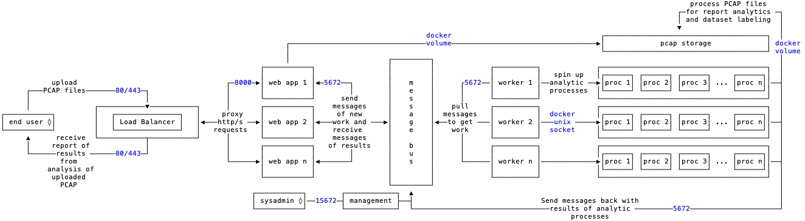

# Architecture

Packet Café is laid out in a series of components, each with their own purpose while still being flexible to add or remove components as needed.

There are 7 major components and any number of analytic processes, or tools, that can be included. By default there [9 analytic processes](https://cyberreboot.gitbook.io/packet-cafe/design/tools) included.

An end user interacts with the `ui` component for uploading PCAP files and interacting with the results of the analytic processes. The `ui` component was built with [ReactJS](https://reactjs.org/) and can be scaled out to `n` instances behind the `load balancer`.

The `lb` component is the load balancer which processes requests to both instances of the `ui` component as well as instances of the `web` component. It allows both of those components to scale out to `n` instances as needed.

The `web` component serves up a RESTful [API](https://cyberreboot.gitbook.io/packet-cafe/design/api#web-port-80) for retrieving results from the analytic processes and passing them on to the `ui` component.

Optionally, there is an `admin` component that serves up a RESTful [API](https://cyberreboot.gitbook.io/packet-cafe/design/api#admin-port-5001) for making requests about the service at a global level to identify sessions, IDs, and files.

The `messenger` component is a [RabbitMQ](https://www.rabbitmq.com/) server which brokers messages between the `web` components, the `workers` components, and the analytic processes.

The `worker` component is responsible for taking requests from the `web` component of files to process and spinning up analytic processes to process those files. These processes can be run in parallel as well as in a pipeline that feeds inputs and outputs in a chain of analytic processes. The `worker` component can be scaled out to `n` number of `workers` and maintains the state and status of jobs in the `redis` component.

The `redis` component is a [Redis](https://redis.io/) server which stores state and status of jobs across the entire system.

