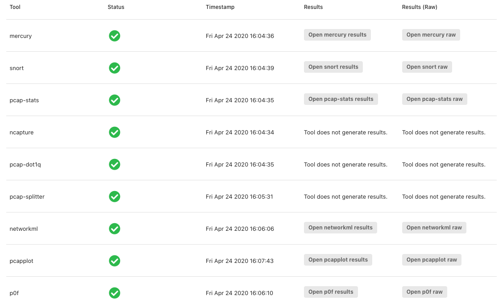

# Results

Once a PCAP file is uploaded, a table will automatically populate and update as the various analytic tools process the PCAP. Some tools, such as `ncapture` don't have an analytic result, but instead modify the input to be an appropriate output to be used as a different input for other tools. In the case of `ncapture` it removes the application payload data of every packet in the PCAP. Similarly, `pcap-dot1q` strips away [802.1q](https://en.wikipedia.org/wiki/IEEE_802.1Q) tags from the capture, and `pcap-splitter` chops up the PCAP into several different PCAPs that isolate conversations from the perspective of each device in the capture.

The rest of the tools, as you can see above all have analytic results that can be viewed. In this initial version both `results` and `raw` have the same content, but `raw` is straight JSON meant for easy consumption into other tools, whereas `results` is a formatted hierarchy viewer and search tool on top of the JSON data.


In future updates we plan to include visualizations and reports to have a more holistic view of the analytics across all of the tools.


