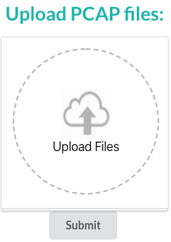

# Uploading PCAP Files

After [deploying](https://iqtlabs.gitbook.io/packet-cafe/deployment) the Packet Café service, you'll be able to browse to [http://0.0.0.0/](http://0.0.0.0/) and be presented with an interface to upload your PCAP files:

You can either drag and drop, or click `Upload Files` and a file browser dropdown will let you choose a file on your local filesystem. Once you've selected you PCAP file, clicking submit will upload the file to the service, and begin kicking off the processing the file against the [9 analytic tools](https://iqtlabs.gitbook.io/packet-cafe/design/tools).


If this is the first time uploading a PCAP file to the service that's just been deployed, it might take several minutes while the images for the 9 analytic tools are being downloaded. It might appear like nothing is happening, but it is downloading the images in the background. After they are downloaded on the first time, any subsequent uploaded PCAPs will immediately start running the analytic tools as the images will already have been downloaded.


